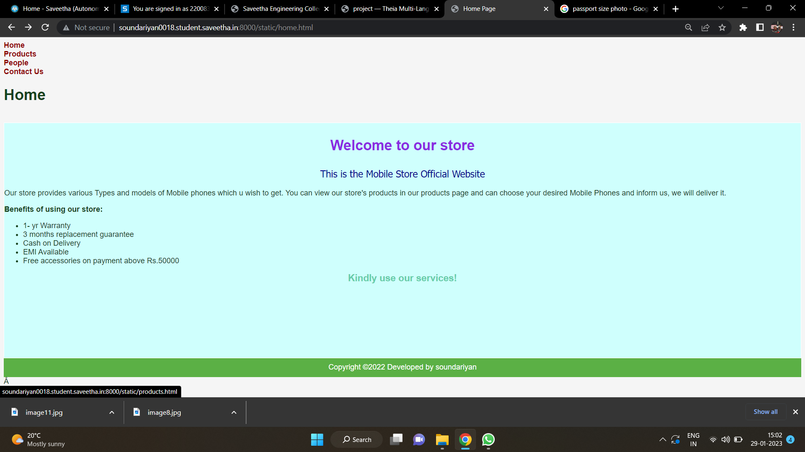
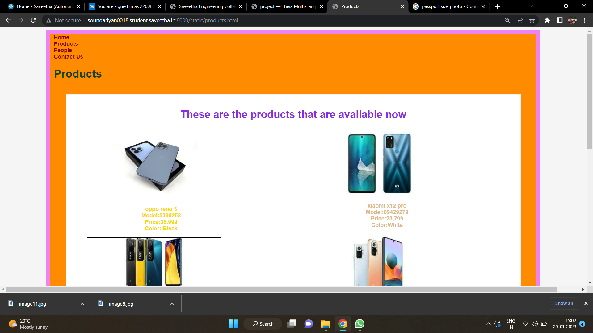
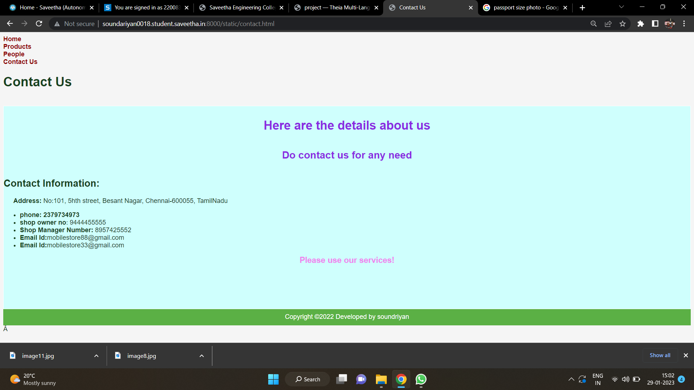
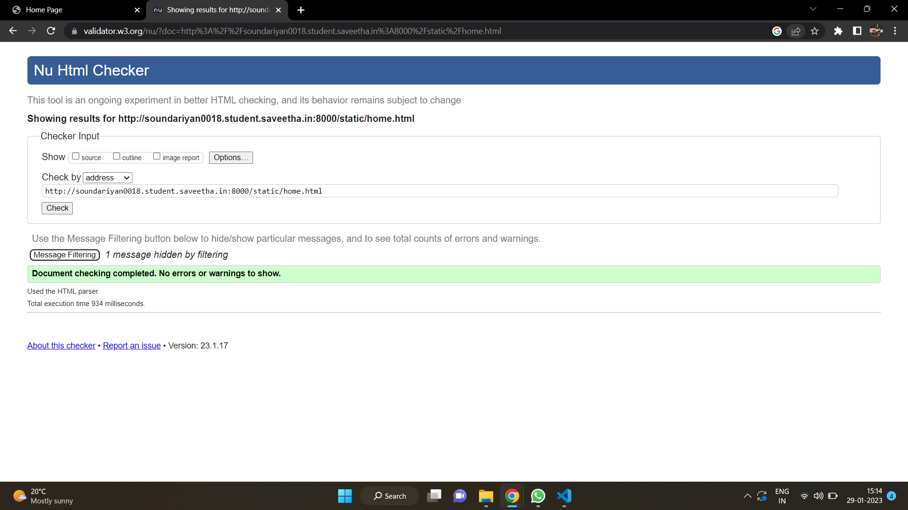

# Web Design for a Software Product Company

## AIM:

To design a static website for a software product company company.

## DESIGN STEPS:

### Step 1:

Requirement collection.

### Step 2:

Creating the layout using HTML and CSS.

### Step 3:

Updating the sample content.

### Step 4:

Choose the appropriate style and color scheme.

### Step 5:

Validate the layout in various browsers.

### Step 6:

Validate the HTML code.

### Step 6:

Publish the website in the given URL.

## PROGRAM :
home.html
```html
<!DOCTYPE html>
<html lang="en">
    <head>
        <title>
            Home Page
        </title>
        <meta name="viewport" 
         content="width=device-width, initial-scale=1.0">
        <link rel="stylesheet" href="/static/css/styles.css">
    <style>
    .text{
        color:blueviolet;
        font-family:'Lucida Sans';
        font-size: 30px;
        text-align:center;
    }
    
    </style>

    </head>
    <body>
        <div class="home">
            <div class="header">
                <header>
                    <div class=logo></div>
                    <div class=h>
                    <a href="home.html" title="Home" 
                    style="color: darkred; text-decoration: none;"><b>Home</b></a></div>
                    <div class="prod">
                        <a href="products.html" title="Products" 
                        style="color: darkred; text-decoration: none;"><b>Products</b></a>
                    </div>
                    <div class="people">
                        <a href="people.html" title="People" 
                        style="color:darkred; text-decoration: none;"><b>People</b></a>
                    </div>
                    <div class="contact">
                        <a href="contact.html" title="Contact Us" 
                        style="color:darkred; text-decoration: none;"><b>Contact Us</b></a>
                    </div>
                </header>
                <div class="title">
                    <h1>Home</h1>
                </div><br>
                <div class="content">
                    <div class="text">
                    <p><b>Welcome to our store</b></p>
                    <p style="color:darkblue; font-family:'Tahoma'; font-size:20px;"> 
                    This is the Mobile Store Official Website</p>
                    </div>
                    <p>Our store provides various Types and models of Mobile 
                        phones which u wish to get. You can view our store's 
                        products in our products page and can choose your 
                        desired Mobile Phones and inform us, we will deliver it.</p>
                    <b>Benefits of using our store:</b>
                    <ul>
                        <li>1- yr Warranty</li>
                        <li>3 months replacement guarantee</li>
                        <li>Cash on Delivery</li>
                        <li>EMI Available</li>
                        <li>Free accessories on payment above Rs.50000</li></ul>
                    <div style="text-align: center;color:mediumaquamarine;font-size:20px;">
                    <b>Kindly use our services!</b></div>

                </div>
                <div class="footer">
                <footer style="color:white">
                Copyright &copy;2022 Developed by soundariyan</footer></div>
            </div>
        </div>
    </body>
</html>

```
products.html
```html
<!DOCTYPE html>
<html lang="en">
    <head>
        <title>
            Products
        </title>
        <meta name="viewport" content="width=device-width, initial-scale=1.0">
        <link rel="stylesheet" href="/static/css/styles.css">
        <style>
        .home{
            height: 1555px;
            width: 85%;
            border: 12px solid violet;
            padding-left:10px;
            padding-right:10px;
            margin-left: auto;
            margin-right:auto;
            background-color:darkorange;
        }
        .text{
            color:blueviolet;
            font-family:'Lucida Sans';
            font-size: 30px;
            text-align:center;
        
        }
        .content{
            border:1px solid whitesmoke;
            background-color: white;
            width:95%;
            height:1190px;
            padding:10px;
            margin-left:auto;
            margin-right:auto;
        }
        .ph1{
            background-image: url(/static/images/out1.jpg);
            background-size: 250px;
            background-position-x: center;
            background-repeat: no-repeat;
            border:1px solid black;
            height:200px;
            width:30%;
            position:relative;
            left: 50px;
        }
        .l1{
            color: gold;
            position:relative;
            right:380px;
            
            
        }
        .ph2{
            background-image: url(/static/images/out2.jpg);
            background-size: 250px;
            background-position-x: center;
            background-repeat: no-repeat;
            border:1px solid black;
            height:200px;
            width:30%;
            position:relative;
            left: 50px;
            
        }
        .l2{
            color: sandybrown;
            position:relative;
            right:380px;
        }
        .ph3{
            background-image: url(/static/images/out3.jpg);
            background-size: 250px;
            background-position-x: center;
            background-repeat: no-repeat;
            border:1px solid black;
            height:200px;
            width:30%;
            position:relative;
            left: 50px;
            
        }
        .l3{
            color: burlywood;
            position:relative;
            right:380px;
        }
        .ph4{
            background-image: url(/static/images/out4.jpg);
            background-position-x: center;
            border:1px solid black;
            height:200px;
            width:30%;
            position:relative;
            left: 700px;
            bottom:930px;
            background-size: 310px;
            background-repeat: no-repeat;
            
            
        }
        .l4{
            color: burlywood;
            position:relative;
            left:270px;
            bottom: 930px;
        }
    
        .ph5{
            background-image: url(/static/images/out5.jpg);
            background-position-x: center;
            border:1px solid black;
            height:200px;
            width:30%;
            position:relative;
            left: 700px;
            bottom:930px;
            background-size: 280px;
            background-repeat: no-repeat;
            
            
        }
        .l5{
            color: cadetblue;
            position:relative;
            left:270px;
            bottom: 930px;
        }

        .ph6{
            background-image: url(/static/images/out6.jpg);
            background-position-x: center;
            border:1px solid black;
            height:200px;
            width:30%;
            position:relative;
            left: 700px;
            bottom:930px;
            background-size: 280px;
            background-repeat: no-repeat;
            
            
        }
        .l6{
            color: crimson  ;
            position:relative;
            left:270px;
            bottom: 930px;
        }
        .bot{
            text-align:center;
            font-size:larger;
            color:magenta;

        }
        </style>
    </head>
    <body>
        <div class="home">
            <div class="header">
                <header>
                    <div class=logo></div>
                    <div class=h>
                    <a href="home.html" title="Home" 
                    style="color: darkred; text-decoration: none;"><b>Home</a></div>
                    <div class="prod">
                        <a href="products.html" title="Products" 
                        style="color: darkred; text-decoration: none;"><b>Products</b></a>
                    </div>
                    <div class="people">
                        <a href="people.html" title="People" 
                        style="color:darkred; text-decoration: none;"><b>People</b></a>
                    </div>
                    <div class="contact">
                        <a href="contact.html" title="Contact Us" 
                        style="color:darkred; text-decoration: none;"><b>Contact Us</b></a>
                    </div>
                </header>
                <div class="title">
                    <h1>Products</h1>
                </div><br>
                <div class="content">
                    <div class="text">
                    <p>These are the products that are available now</p>
                    </div>
                    <div class="ph1"></div>
                    <div class="l1"><p align="center"><b>oppo reno 3<br> 
                    Model:5398258<br>Price:38,999<br> Color: Black</b></p></div>
                    <div class="ph2"></div>
                    <div class="l2"><p align="center"><b>samsung m22<br>
                    Model:29340934<br>Price:15.999<br>Color:marine blue</b></p></div>
                    <div class="ph3"></div>
                    <div class="l3"><p align="center"><b>redmi note 12 pro<br>
                    Model:4003284<br>Price:18,999<br>Color:Black</b></p></div>
                    <div class="ph4"></div>
                    <div class="l4"><p align="center"><b>xiaomi x12 pro<br>
                    Model:09429279<br>Price:23,799<br>Color:White</b></p></div>
                    <div class="ph5"></div>
                    <div class="l5"><p align="center"><b>Apple iphone 13 pro <br>
                    Model:2S3418<br>Price:1,30,999<br>Color:Grey</b></p></div>
                    <div class="ph6"></div>
                    <div class="l6"><p align="center"><b>Apple iphone 13 pro max <br>
                    Model:3489279<br>Price:1,69,999<br>Color:grey</b></p></div>
         
                </div>
                <div class="bot"><p>To Order Online: Call 90987 97678, 97565 90787</p></div>

                <div class="footer">
                <footer style="color:white">
                Copyright &copy;2022 Developed by soundariyan</footer></div>
            </div>
        </div>
    </body>
</html>

```
people.html
```html
<!DOCTYPE html>
<html lang="en">
    <head>
        <title>
            People
        </title>
        <meta name="viewport" content="width=device-width, initial-scale=1.0">
        <link rel="stylesheet" href="/static/css/styles.css">
        <style>
        .home{
            height: 3000px;
            width: 85%;
            border: 12px solid violet;
            padding-left:10px;
            padding-right:10px;
            margin-left: auto;
            margin-right:auto;
            background-color:darkorange;
        }
        .text{
        color:blueviolet;
        font-family:'Lucida Sans';
        font-size: 30px;
        text-align:center;
        
        }
        .content{
            border:1px solid whitesmoke;
            background-color: white;
            width:95%;
            height:2690px;
            padding:10px;
            margin-left:auto;
            margin-right:auto;
        }
        .ceoph{
            background-image: url(/static/images/image11.jpg);
            background-size: 250px;
            background-position-x: center;
            background-repeat: no-repeat;
            border:1px solid black;
            height:300px;
            width:20%;
            position:relative;
            left: 0px;
            margin-left:auto;
            margin-right: auto;
        }
        .ceo{
            color: gold;
            position:relative;
            text-align:center;
            
            
        }
        .manph1{
            background-image: url(/static/images/download.jpeg);
            background-size: 250px;
            background-position-x: center;
            background-repeat: no-repeat;
            border:1px solid black;
            height:300px;
            width:20%;
            position:relative;
            margin-left:auto;
            margin-right:auto;            
        }
        .man1{
            color: sandybrown;
            position:relative;
            text-align:center;
            
        }
        .manph2{
            background-image: url(/static/images/image2.jpeg);
            background-size: 250px;
            background-position-x: center;
            background-repeat: no-repeat;
            border:1px solid black;
            height:300px;
            width:20%;
            position:relative;
            margin-left:auto;
            margin-right:auto;

            
        }
        .man2{
            color: burlywood;
            position:relative;
            text-align:center;
        }
        
        .amph1{
            background-image: url(/static/images/image8.jpg);
            background-size: 250px;
            background-position-x: center;
            background-repeat: no-repeat;
            border:1px solid black;
            height:300px;
            width:20%;
            position:relative;
            margin-left:auto;
            margin-right:auto;

            
        }
        .am1{
            color: burlywood;
            position:relative;
            text-align:center;
        }

        .amph2{
            background-image: url(/static/images/image3.jpeg);
            background-size: 250px;
            background-position-x: center;
            background-repeat: no-repeat;
            border:1px solid black;
            height:220px;
            width:20%;
            position:relative;
            margin-left:auto;
            margin-right:auto;

            
        }
        .am2{
            color: burlywood;
            position:relative;
            text-align:center;
        }
        .amph3{
            background-image: url(/static/images/image4.jpeg);
            background-size: 250px;
            background-position-x: center;
            background-repeat: no-repeat;
            border:1px solid black;
            height:250px;
            width:20%;
            position:relative;
            margin-left:auto;
            margin-right:auto;

            
        }
        .am3{
            color: burlywood;
            position:relative;
            text-align:center;
        }
        </style>
    </head>
    <body>
        <div class="home">
            <div class="header">
                <header>
                    <div class=logo></div>
                    <div class=h>
                    <a href="home.html" title="Home" 
                    style="color: darkred; text-decoration: none;"><b>Home</b></a></div>
                    <div class="prod">
                        <a href="products.html" title="Products" 
                        style="color: darkred; text-decoration: none;"><b>Products</b></a>
                    </div>
                    <div class="people">
                        <a href="people.html" title="People" 
                        style="color:darkred; text-decoration: none;"><b>People</b></a>
                    </div>
                    <div class="contact">
                        <a href="contact.html" title="Contact Us" 
                        style="color:darkred; text-decoration: none;"><b>Contact Us</b></a>
                    </div>
                </header>
                <div class="title">
                    <h1>People</h1>
                </div><br>
                <div class="content">
                    <div class="text">
                    <p>These are our proud management crew!</p>
                    <h4><u>Chairman</u></h4>
                    </div>
                    <div class="ceoph"></div>
                    <div class="ceo"><p align="center"><b>
                        <h2>Mukesh Ambani</h2></b></div>
                    <br>
                    <div class="text">
                        <p><b><u>Head executives</u></b></p><br>
                    </div>
                    <div class="manph1"></div>
                    <div class="man1"><p align="center"><b>
                        <h2>Nita Ambani</h2></b></p></div>
                    <div class="manph2"></div>
                    <div class="man2"><p><b>
                        <h2>Shah Rukh Khan</h2></b></p></div>
                    <br>
                    <div class="text"><p><b><u>Managers</u></b></p></div><br>
                    <div class="amph1"></div>
                    <div class="am1"><p align="center"><b>
                        <h2>Isha Ambani</h2></b></p></div>
                    <div class="amph2"></div>
                    <div class="am2"><p align="center"><b>
                        <h2>Akash Ambani</h2></b></p></div>
                    <div class="amph3"></div>
                    <div class="am3"><p align="center"><b>
                        <h2>Deepika Padukone</h2></b></p></div><br>
                    <div class="text">Thank you so much for your kind support!
                        <br>Hope our products had helped you!</div>
                </div>
                <div class="footer">
                <footer style="color:white">
                Copyright &copy;2022 Developed by sounadariyan</footer></div>
            </div>
        </div>
    </body>
</html>

```
contact.html
```html
<!DOCTYPE html>
<html lang="en">
    <head>
        <title>
            Contact Us
        </title>
        <meta name="viewport" 
         content="width=device-width, initial-scale=1.0">
        <link rel="stylesheet" href="/static/css/styles.css">
    <style>
    .text{
        color:blueviolet;
        font-family:'Lucida Sans';
        font-size: 30px;
        text-align:center;
    }
    
    </style>

    </head>
    <body>
        <div class="home">
            <div class="header">
                <header>
                    <div class=logo></div>
                    <div class=h>
                    <a href="home.html" title="Home" 
                    style="color: darkred; text-decoration: none;"><b>Home</b></a></div>
                    <div class="prod">
                        <a href="products.html" title="Products"
                         style="color: darkred; text-decoration: none;"><b>Products</b></a>
                    </div>
                    <div class="people">
                        <a href="people.html" title="People" 
                        style="color:darkred; text-decoration: none;"><b>People</b></a>
                    </div>
                    <div class="contact">
                        <a href="contact.html" title="Contact Us" 
                        style="color:darkred; text-decoration: none;"><b>Contact Us</b></a>
                    </div>
                </header>
                <div class="title">
                    <h1>Contact Us</h1>
                </div><br>
                <div class="content">
                    <div class="text">
                    <p><b>Here are the details about us
                    <h5>Do contact us for any need</h5></b></p>
                    
                    </div>
                    <b><h2>Contact Information:</h2></b>
                    <p><b>&emsp;&ensp;Address:</b>
                         No:101, 5hth street, Besant Nagar, Chennai-600055, TamilNadu
                    </p>
                    <ul>
                        <li><b>phone: 2379734973</b></li>
                        <li><b>shop owner no</b>: 9444455555</li>
                        <li><b>Shop Manager Number:</b> 8957425552</li>
                        <li><b>Email Id:</b>mobilestore88@gmail.com</li>
                        <li><b>Email Id:</b>mobilestore33@gmail.com</li>
                    </ul>
                    <div style="text-align: center;color:violet;font-size:20px;">
                    <b>Please use our services!</b></div>

                </div>
                <div class="footer">
                <footer style="color:white">
                Copyright &copy;2022 Developed by soundriyan</footer></div>
            </div>
        </div>
    </body>
</html>

```
styles.css
```css
* {
  box-sizing: border-box;
  font-family: Arial, Helvetica, sans-serif;
}
body {
  background-color: whitesmoke;
  color: #17421d;
}
.container {
  width: 1080px;
  margin-left: auto;
  margin-right: auto;
  border-width: 1px 1px 1px 1px;
  border-style: solid;
  box-shadow: 15px 15px 8px gray;
}

.banner {
  display: block;
  width: 100%;
  height: 250px;
  text-align: center;
  font-size: 60px;
  background-image: url("/static/img/banner1.jpg");
  background-size: 100% 100%;
  margin: 0px 0px 0px 0px;
  padding-top: 150px;
  color: #16d1ae;
}

.menu {
  display: block;
  width: 100%;
  height: 50px;
  font-size: larger;
  background-color: #5bb045;
  text-align: center;
  padding-top: 15px;
  margin: 0px 0px 0px 0px;
  border-width: 1px;
}

.menuitem {
  display: inline-block;
  margin-left: 10px;
  margin-right: 10px;
}
.menuitemselected {
  display: inline-block;
  margin-left: 10px;
  margin-right: 10px;
  color: #16d1ae;
}

.menuitem a {
  text-decoration: none;
  color: #9c1018;
}

.content {
  display: block;
  width: 100%;
  background-color: #cffffd;
  min-height: 500px;
  margin: 0px 0px 0px 0px;
  border-width: 1px;
  border-color: white;
  border-style: solid;
}
.homecontent {
  min-height: 500px;
  margin: 10px 10px 10px 10px;
}
.homecontent h1 {
  text-align: left;
}
.homecontent img {
  float: right;
  width: 400px;
  height: 300px;
  margin-left: 10px;
}

.contenttext {
  text-align: justify;
}

.productcontent {
  min-height: 500px;
  margin: 10px 10px 10px 10px;
}

.productcontent h1 {
  text-align: left;
}

.productitems {
  display: block;
}

.productitem {
  display: inline-block;
  width: 30%;
  height: 250px;
  text-align: center;
}

.productitem img {
  width: 100px;
  height: 100px;
  display: block;
}
.productitem .itemimage {
  display: block;
  margin-left: auto;
  margin-right: auto;
  width: 100px;
  margin-bottom: 5px;
}

.productitem .itemname {
  display: block;
}
.productitem .itemprice {
  display: block;
}

.footer {
  display: block;
  width: 100%;
  height: 40px;
  background-color: #5bb045;
  text-align: center;
  padding-top: 10px;
  margin: 0px 0px 0px 0px;
  color: #9c1018;
}

```
## OUTPUT:

### Home Page:


## product page:

## people pagee:

## contact page:


## HTML Validator:


## Result:

Thus a website is designed for the software product company and the HTML,CSS code are validated.
